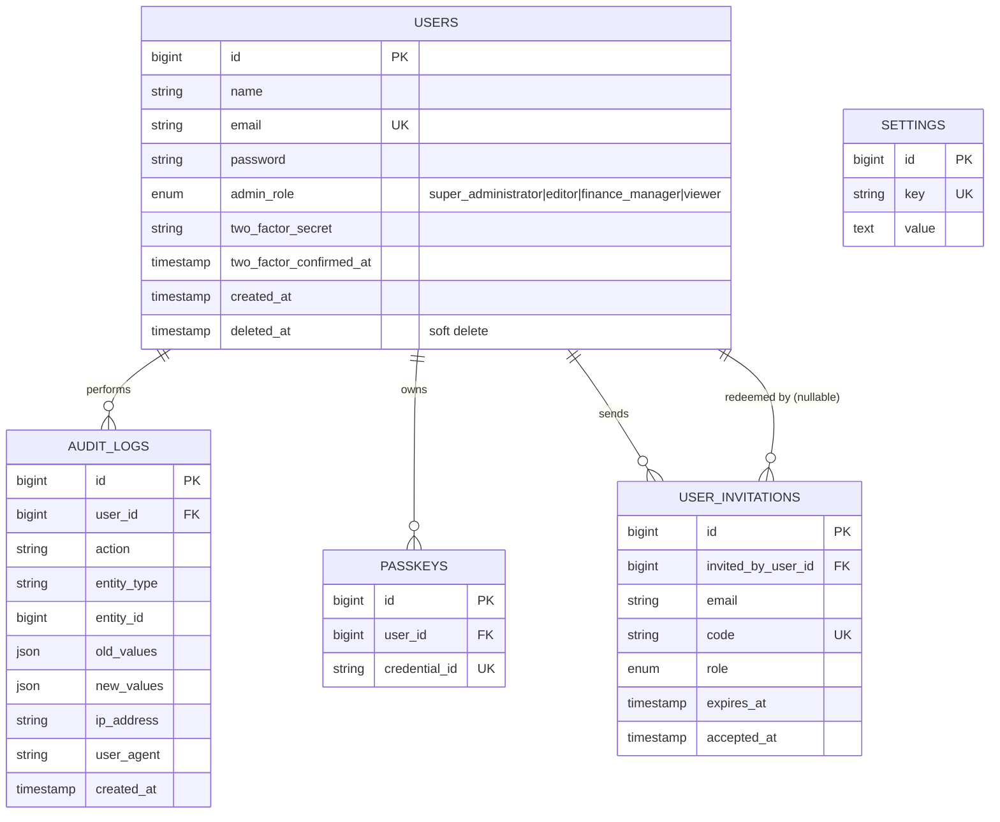
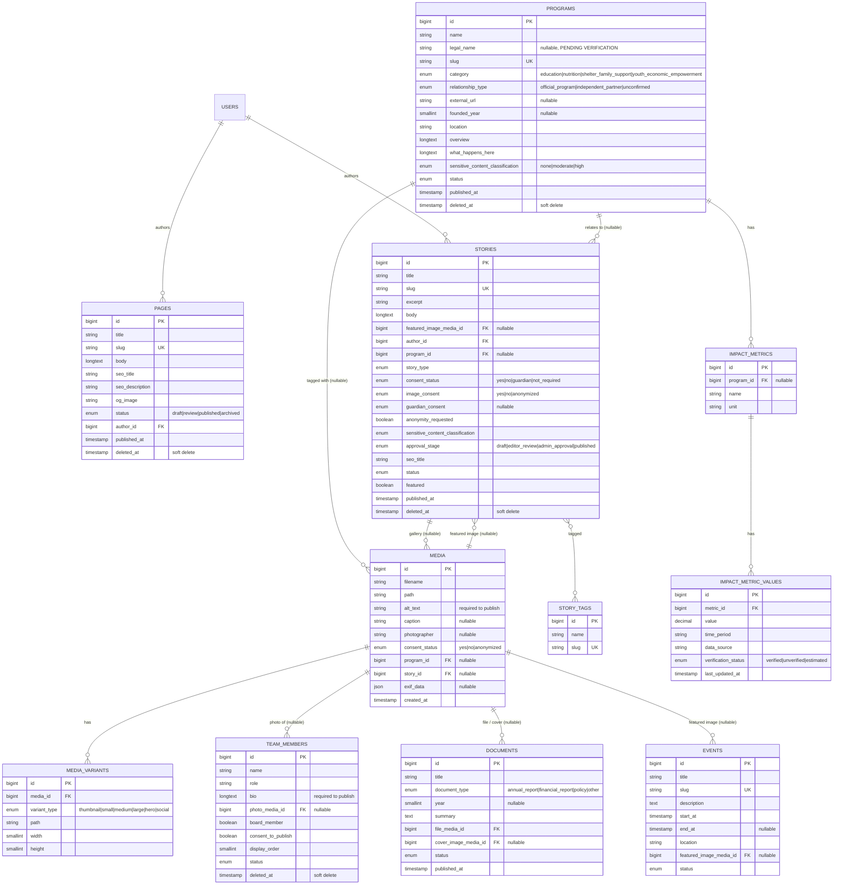
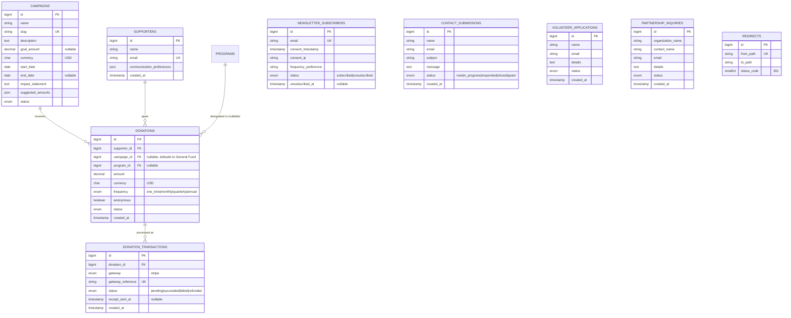

# Database ERD

**Phase:** 4 — Architecture
**Status:** Decided, implementation-ready for Phase 5 migrations
**Inputs:** `docs/content-model.md`, `docs/architecture/authorization-model.md`, saba.md §12

This document turns `docs/content-model.md`'s product-level entities into table-level schema: keys, indexes, soft-delete policy, and relationships. Diagrams are grouped into three bounded contexts (Auth & System, Content & Media, Fundraising & Engagement) rather than one large ERD — at ~25 tables, a single diagram is unreadable; saba.md's own admin module grouping (§10.1) already implies these boundaries.

---

## 0. Deviations From saba.md §12.1's Table List

Each one is a deliberate simplification, not an oversight — rationale given so it isn't second-guessed later without context:

| saba.md §12.1 suggests | This ERD does instead | Why |
|---|---|---|
| Separate `roles`, `permissions`, `role_permission`, `user_role` tables | `admin_role` enum column on `users` | `docs/architecture/authorization-model.md` §2 — 4 fixed roles, no admin-configurable RBAC needed in V1. |
| `teams` (implied by the existing scaffold, not actually in saba.md's list) | Dropped entirely | authorization-model.md §1 — multi-tenancy doesn't fit a single-organization CMS. |
| Separate `seo_metadata` table (polymorphic) | SEO fields (`seo_title`, `seo_description`, `og_image`) inline on `pages`, `programs`, `stories`, `documents` | Only 4 content types need SEO metadata; a polymorphic table adds join complexity without a real payoff at this scale. |
| `program_media` join table | `media.program_id` direct nullable FK | Content-inventory found no evidence of media needing to belong to *multiple* programs simultaneously; a direct FK is simpler and can migrate to a pivot later if that need appears. |
| Implicit `program_designation` as a free-text/enum field | `donations.program_id` — a real nullable FK to `programs` | content-model.md §2.6 described this as an enum of program names; an FK avoids the enum drifting out of sync with the actual `programs` table as programs are added/renamed. |
| `partners` + `partner_programs` as separate from `programs` | Merged into one `programs` table with a `relationship_type` column | ADR-001 §3.6 / content-model.md §2.2 — the current live site's own boundary between "program" and "partner" is blurry (Hunter Initiative), so the schema doesn't force a premature split. |

Everything else below matches saba.md §12.1's entity list in substance, grouped differently only for diagram readability.

---

## 1. Auth & System

**Indexing:** `users.email` unique; `audit_logs.user_id`, `audit_logs.entity_type`+`entity_id` composite (audit lookups are almost always "show me the history of this record"); `user_invitations.code` unique; `settings.key` unique.

**Retention:** `audit_logs` is **never** soft-deleted or purged automatically — it's the record of privileged actions saba.md §10.3 requires. If retention limits are ever needed for storage reasons, that's an explicit archival job, not a default `deleted_at`.

---

## 2. Content & Media

**Indexing:** every `slug` column (unique); every FK column; `stories.status` + `stories.published_at` composite (the "latest published stories" query runs on every homepage load); `media.program_id`, `media.story_id`; `impact_metric_values.metric_id` + `verification_status` (the "show qualitative fallback if nothing verified" query from content-model.md §2.8 depends on this).

**Soft deletes:** `pages`, `programs`, `team_members`, `stories` — the editorial content tables per saba.md §12.2's rule. `media`, `media_variants`, `story_tags`, `impact_metrics`, `impact_metric_values`, `documents`, `events` are **not** soft-deleted — they're either derived/dependent records (variants) or low-risk-to-hard-delete reference data; soft-deleting everything indiscriminately adds query complexity (`whereNull('deleted_at')` everywhere) without a matching recovery need.

**Publish guards** (enforced in the model/policy layer, not the schema — see `docs/content-model.md` §2.3/§2.4): `team_members.bio` and `stories.consent_status` block the `published` status transition when empty/unset.

---

## 3. Fundraising & Engagement

**Indexing:** `supporters.email` unique (a returning donor should map to one record); `donations.status`, `donations.campaign_id`, `donations.supporter_id`; `donation_transactions.gateway_reference` unique (idempotency for Stripe webhook replay — a webhook retried by Stripe must not create a duplicate transaction record); `newsletter_subscribers.email` unique; `redirects.from_path` unique (this table is a lookup table hit on every request during the Phase 12 migration window, so it needs to be fast and collision-free).

**No soft deletes on this group.** These are transactional/log-like records (a donation, a submitted form, an audit-relevant redirect) — "deleting" a donation record should never actually remove financial history; that's a `status` change (e.g., `refunded`), not a row deletion. `Campaign` is the one editorial-ish table here and could reasonably get soft deletes if campaigns are ever archived mid-life; deferred until that's a real scenario (V1 ships one seeded campaign per `docs/product-requirements.md` §3).

---

## 4. Cross-Reference to Content Model

Every field here traces back to `docs/content-model.md` — this document only adds implementation-level decisions (keys, indexes, soft-delete policy, FK vs. enum) on top of that product-level definition. Where the two differ (§0 table above), this ERD wins for Phase 5 implementation purposes.
