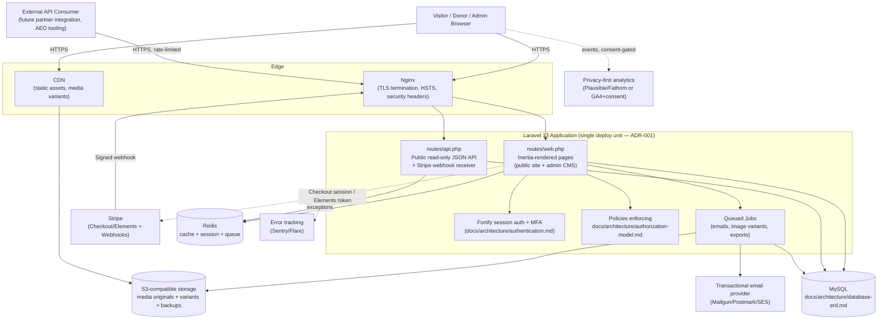

# System Architecture

**Phase:** 4 — Architecture
**Status:** Decided
**Inputs:** All prior Phase 4 documents in `docs/architecture/`

This is the capstone diagram for Phase 4's architecture checklist (saba.md §32) — it ties together the decisions made in ADR-001 and the authorization/authentication/API/database documents into one picture. It does not introduce new decisions.

---

## 1. Component Diagram

---

## 2. Component Notes

| Component | Decision reference | Notes |
|---|---|---|
| Single Laravel application | ADR-001 | One deploy unit serves the public site, admin CMS, and the thin public API — not three separate services. |
| `routes/web.php` (Inertia) | ADR-001, authentication.md §2 | Primary path for all human users — visitors, donors, admins. Session-based auth throughout. |
| `routes/api.php` | api-architecture.md | Deliberately thin: 5 read-only resource groups + 1 webhook receiver. No admin API namespace (api-architecture.md §6). |
| MySQL | database-erd.md | Single database; no read-replica or multi-region requirement identified anywhere in saba.md or the audits — not architected for a scale problem this org doesn't have. |
| Redis | saba.md §19.2 | Sessions, cache (route/config/query caching per saba.md §19.2), and queue backend for Jobs. One Redis instance is sufficient at this scale. |
| Queued Jobs | saba.md §21.2 | All transactional email is queued, never synchronous (receipt, confirmations, admin notifications, donation-abandonment recovery once built). Also handles media variant generation (saba.md §20.2) so uploads don't block the admin UI. |
| S3-compatible storage | saba.md §20, §25.1 | Media originals + generated variants, plus the off-site encrypted backup target (`docs/architecture/*` backup/DR doc — not yet written, see §4 below). |
| CDN | saba.md §19.2 | Serves static assets and media variants; origin is S3, not the Laravel app — keeps the app server from serving binary media traffic. |
| Stripe | product-requirements.md §3 | V1's only payment gateway (`StripeGateway` implementing `PaymentGatewayInterface`, saba.md §8.3) — outbound for Elements/Checkout token creation, inbound via the signature-verified webhook. |
| Analytics | product-requirements.md §9 | Fires only with consent (closing `docs/audit/current-website-audit.md` F-5's unconditional-GA4 finding). |
| Error tracking | saba.md §29 (CI/CD), Phase 8 | Not yet specified in detail — flagged in §4 below as a remaining Phase 4/8 item. |

---

## 3. Deployment Topology (preview — full detail belongs in a dedicated deployment-architecture doc, not yet written)

AGENTS.md already names the intended host: *"Laravel can be deployed using Laravel Cloud, which is the fastest way to deploy and scale production Laravel applications."* This is consistent with the single-deploy-unit architecture above — Laravel Cloud natively handles the app server, queue workers, and scheduler for one Laravel application without needing separately orchestrated services, which matches ADR-001's operational-simplicity reasoning (§3.2 of that ADR). This is a strong default, not yet a final decision — see open items below.

---

## 4. What's Still Open in Phase 4

This diagram completes the checklist items that depend on ADR-001 being decided (system architecture, database ERD, API architecture, auth architecture, authorization model — all done as of this document). Three saba.md §32 Phase 4 items remain and are natural next steps, each smaller/more self-contained than what's been done so far:

1. **Payment architecture detail** — the `PaymentGatewayInterface` abstraction itself (saba.md §8.3), specific to `StripeGateway`'s implementation shape, PCI SAQ-A boundary, and how `donation_transactions.gateway_reference` idempotency (database-erd.md §3) is enforced against Stripe webhook retries.
2. **Media architecture detail** — the upload → variant-generation (Jobs, per §2 above) → CDN pipeline in full, including the focal-point cropping and EXIF handling saba.md §20 asks for.
3. **Deployment architecture** — confirming Laravel Cloud (or an alternative) with actual environment topology (local/testing/staging/production per saba.md §30), CI/CD pipeline detail (saba.md §29), and the backup/DR plan (saba.md §25) that a "single S3-compatible storage" box in this diagram currently just gestures at.

None of these block Phase 5 backend work from starting on the pieces already decided (models, migrations per the ERD, policies per the authorization model) — but the payment and media pipelines specifically should be nailed down before writing the `Donation`/`Media` upload code that depends on them.
